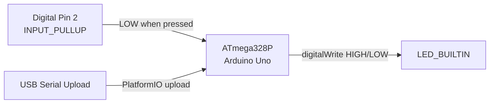

# Project-Jarvis


## The Hook

Embedded firmware prototype for a physical Jarvis-style interaction: a momentary button on digital pin 2 toggles the onboard LED, establishing the I/O foundation for future voice or sensor integrations on Arduino Uno hardware.

## System Architecture



## Key Features & Metrics

- **Minimal control loop** — single `loop()` reads button state and drives LED with no blocking delays; suitable for **~16 MHz** Uno tick rates without timer drift.
- **Internal pull-up input** — `INPUT_PULLUP` eliminates external resistor on pin 2; active-low press detection (`buttonState == LOW`).
- **PlatformIO env:uno** — targets `atmelavr` platform with `framework = arduino` for reproducible builds across team machines.
- **Zero external libraries** — only `<Arduino.h>`; firmware fits comfortably within Uno **32 KB** flash budget.

## Technical Implementation Notes

- **Active-low button semantics** — HIGH = released (pull-up idle), LOW = pressed; LED mirrors pressed state directly with no debounce (acceptable for LED demo; production would add **~20–50 ms** debounce).
- **No serial/debug output** — `setup()` configures pins only; no `Serial.begin()`, keeping power and timing predictable for battery-powered extensions.
- **Extension path** — `lib/` and `include/` scaffolds exist for future modular drivers (I2C displays, relays) without restructuring `src/main.cpp`.

## Local Deployment

```bash
cd Jarvis_Arduino_Test
pio run -t upload
pio device monitor
```

Requires PlatformIO CLI and Arduino Uno connected via USB.

## Project Structure

```
Project-Jarvis/
└── Jarvis_Arduino_Test/
    ├── platformio.ini       # env:uno, atmelavr
    ├── src/main.cpp         # Button → LED control loop
    ├── include/             # Header scaffold
    ├── lib/                 # Library scaffold
    ├── test/                # Test scaffold
    └── .vscode/             # IntelliSense + launch config
```
